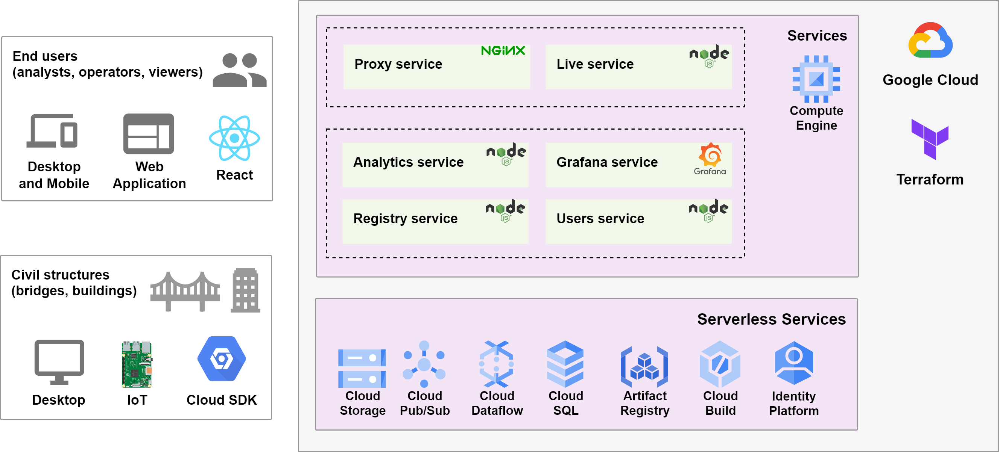
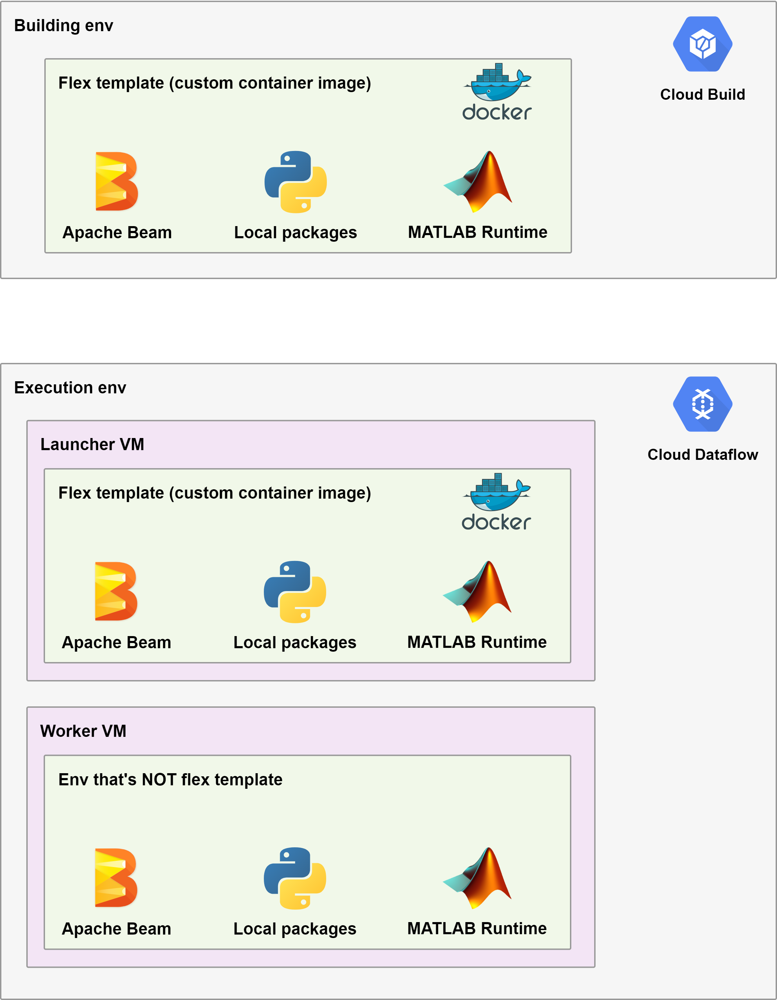

# Monitoreo - prototype for management of smart civil infrastructure with structural health monitoring

This is a prototype to facilitate the management, development, integration and deployment of information and data analytics pipelines related to management of smart civil infrastructure with structural health monitoring based on IoT/sensing systems. This is deployed to GCP - Google Cloud Platform.

TODO demo

## Description

General components:
- Cloud SDK as client in IoT/sensing systems from civil structures for ingestion of data.
- Web application client for managing simple resources with CRUD operations (i.e. Create, Read, Update, Delete), and parameterizing and executing data pipelines.
- Services in GCP supporting clients and deployment of data pipelines.



Data pipelines can support both batch and stream processing of files in local or Cloud Storage. Ingestion of data can be configured in two ways accordingly:
- Upload to a bucket of historical measures files with no notification configuration.
- Upload to a bucket of real-time measures files with notificaton configuration to Cloud PubSub.

> Note: ingestion can be easily extended to packets sent from IoT/sensing systems to Cloud PubSub but currently I have not worked on this.


I developed pipelines with Apache Beam Python SDK with operators/transformations in local packages for processing data executing algorithms or programs developed in MATLAB (as far as you comply with licensing) by using Flex Templates from Cloud Dataflow from GCP, or Custom Containers from Apache Beam with support to other distributed processing engines in the context of [Portability Framework](https://beam.apache.org/roadmap/portability/).



## Up and running

> **DISCLAIMER**: I'm a civil engineer enthusiast about software engineering, so there are issues that should be first assessed by professionals before using this prototype in actual production.

> Note: all scripts in this repo has been correctly executed in Ubuntu; they should be compatible with Bash in any Debian-based Linux distribution and macOS except those installing packages with `apt-get`.

### Local

Run one of following steps:
- Ensure local dependencies of interest listed in [init-local-env.sh](init-local-env.sh) are available.
- Install all local dependencies in your Debian-based machine (**NOT RECOMMENDED** but possible):
  > **WARNING**: this may misconfigure your system, for example, script overwrites `/etc/environment`; modify script if required.
    ```bash
    chmod +x init-local-env.sh
    ./init-local-env.sh
    ```
- Provision and configure a virtual machine with Vagrant and VirtualBox:
    ```bash
    vagrant plugin install vagrant-disksize
    vagrant up
    vagrant ssh
    ```
  TODO describe requirements and specifications

Lift up services following instructions in [services/README.md](services/README.md)

Setup analytics dependencies following instructions in [analytics/packages/](analytics/packages/) and [analytics/pipelines/](analytics/pipelines/)

> Note: local env requires to setup Cloud Storage and Cloud Dataflow in cloud env for uploading files through [registry service](services/registry) and deployment of data pipelines through [analytics service](services/analytics).

### GCP - Google Cloud Platform

> Note: following instructions require a GCP project with billing enabled and with Identity Platform configured for using Google as identity provider (this latter is not possible through Terraform).

Define general variables:
```bash
export MONITOREO_REPO=
export GCP_APPLICATION_CREDENTIALS=~/.config/gcloud/application_default_credentials.json
export GCP_IDENTITY_PLATFORM_API_KEY=
export GCP_IDENTITY_PLATFORM_AUTH_DOMAIN=
export GCP_LOCATION=
export GCP_PROJECT_ID=
```
> Note: change `GCP_APPLICATION_CREDENTIALS` value if required.

Log in with `gcloud` if not using Cloud Shell: 
```bash
gcloud config set project $GCP_PROJECT_ID
gcloud auth login
gcloud auth application-default login
```

Initialize cloud environment with Terraform and Docker:
```bash
chmod +x init-cloud-env.sh

# Run Terraform, Create database schemas, and build Cloud Dataflow Flex Templates
RUN_ALL=true ./init-cloud-env.sh

# Run Terraform
RUN_TERRAFORM=true ./init-cloud-env.sh

# Create schemas in Cloud SQL
CREATE_DB_SCHEMAS=true ./init-cloud-env.sh

# Build Cloud Dataflow Flex Templates
BUILD_DATAFLOW_TEMPLATES=true ./init-cloud-env.sh
```
> Notes:
> - Initialization consists of provisioning cloud resources, creating database schemas, and building Cloud Dataflow Flex templates.
> - Using local backend for Terraform state may have some issues; using a remote backend such as Cloud Storage or Terraform Cloud is preferable.
> - Docker is required for running Cloud SQL Auth proxy to connect Cloud SQL service as database is configured with private IP.
> - Currently there is no CI/CD pipelines for services neither data analytics. Any change to services would require to run Terraform to destroy and create again Compute Engine instance.
> - Environment variables related to Cloud Identity Platform should be part of a CI/CD pipeline. Those are used within startup script as an initial implementation for prototyping.

In development may be necessary to use `MONITOREO_ROOT` and/or `TERRAFORM_OUTPUT` environment variables for some scripts:
> Note: following definitions consider directory containing this document as current directory:
```bash
export MONITOREO_ROOT=$PWD
export TERRAFORM_OUTPUT=$(terraform -chdir=./infrastructure/terraform output -json)
echo "MONITOREO_ROOT: ${MONITOREO_ROOT}"
echo -e "TERRAFORM_OUTPUT:\n${TERRAFORM_OUTPUT}"
```

## TODOs

- Validation of analysis configuration for analytics in both [analytics service](services/analytics) and [data pipelines](analytics/pipelines).
