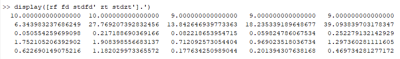

# Validation of processing with `matlab_modal_id` package

I validate processing of [`modal.py` pipelines](../src/modal.py) with `matlab_modal_id` package by comparing output results as equal regarding a reference modal identification from dynamic characterization of prestressed beams during load testing in laboratory, performed by "Grupo de investigación G7" (Research Group G7) in project "Evaluación y monitoreo de la integridad estructural de puentes preesforzados" (assessment and monitoring of structural integrity in prestressed bridges).

Input file processed in both reference and validation pipeline: [221800000_0002BF20](../data/221800000_0002BF20)

Analysis configuration used in both reference and validation processing:
```json
{
    "response": {
        "use_matlab": true,
        "detrend": true,
        "resampling_rate": 100
    },
    "modal": {
        "technique": "ssi",
        "technique_params": {
            "freqtol": 0.05,
            "mactol": 0.95,
            "minfound": 5,
            "npoints": 1800,
            "order": 16
        }
    }
}
```

Querying results in analytics database:
```sql
select data->'rf' as rf, data->'fd' as fd, data->'stdfd' as stdfd, data->'zt' as zt, data->'stdzt' as stdzt from results where metadata->>'path' ~ '221800000_0002BF20$';
```

Screenshots of results:

- Reference results from MATLAB (command window):

    

- Validation results from data pipeline (database query):

    

- Validaton results from data pipeline (Grafana table):

    